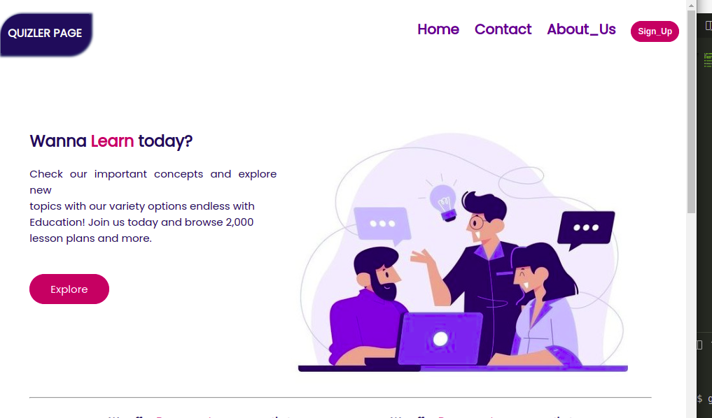
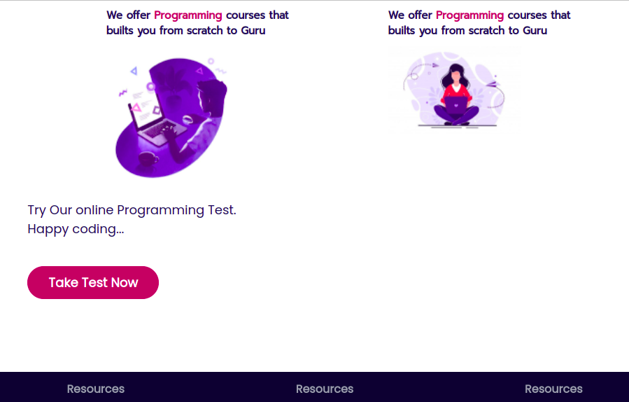
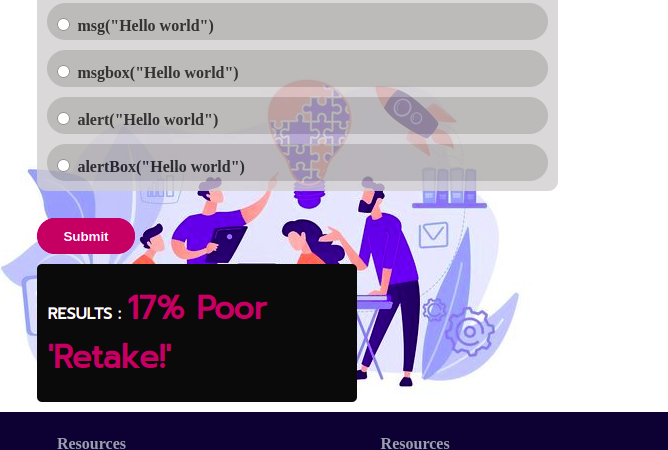

# QUIZ-BORD(quizler)
***
## DESCRIPTION
Quiz bord  is a website that Brings a simple tech solution to student. This helps them Learn programming languages and Taking Exam questions to test their learning progress. The website is well design and user friendly ranging from design, color and the logic part that is implemented with Javascript(calculation of marks).
 example:

<br  />
## Site:
Here is a working demonstration of this Web page: https://jobsidney.github.io/Quiz-Board/
<br  />

To take the Exam Test Scroll through the page and CLick the `Take your Test` button as Illustrated below:
  

<br  />
After taking the Test press submit to see your scores and comment of the TEST you've taken.
Example:

<br  />

## [Features](https://jobsidney.github.io/Quiz-Board/)

- Well Designed Interface(UI).
- intensive use of pure css for design
- Vannilla Javascript
- HTML5
- Switch to multiple pages via links and buttons
- Responsive to variety of devices like mobile,tablet and PC

## [InstallationInstructions](https://jobsidney.github.io/Quiz-Board/) 
Click on the provided link that will direct you to the website
#### requirements:
- chrome browser/any other browser
- any type of computer(phone of laptop)
- Internet connection

### How To Contribute

The process below will enable you make contribution to this website for a better view and functionality

- Fork the repo
- Create a new branch (`git checkout -b AddingFeatures`).
- Make the changes you want to the files and folders.
- Add the changes (`git add .`).
- to reflect the changes.
- commit changes (`git commit -m 'This is a Proj COntribution commit'`).
- push changes to the branch (`git push origin AddingFeatures`).
- Do a pull Request. 

## Target to future improvement
- Incoperate JQuery,Nodejs
- Add Animated background

### Program Sample
#### Html code
```Html
  <section id="examSec">
        <div class="examText">
            Try Our online Programming Test. <br>Happy coding...
        </div>
        <div class="btn2">
            <a href="./assets/html/page2.html" target="_self">
                Take Test Now
            </a>
        </div>
    </section>
```

#### Css
    Example of Css with media query for responsiveness
```Css
/* Phones */
@media screen and (max-width:700px) {
    #Logo{
        padding-top: 15px;
        border-radius: 30px 0px 30px 0px;
        padding-left: 10px;
        padding-right: 10px;
        background-color: #162959;
        color: white;
        font-weight: bolder;
        box-shadow: 2px 2px 3px 3px #162959;
        font-family: Poppins;
    }
```
#### Javascript
    Example of working javascript code
```Javascript
finalResults=Math.ceil((results/6)*100)
    var display;
    output();
    function output(){
        if (finalResults>=80) {
            display=(' '+ finalResults + '%'+" "+"Excellent")
            
        }
        else if(finalResults>=50){
            display=(' '+ finalResults + '%'+" "+"Fair")
        }
```
## ProgramDesign

## PROJECT AUTHOR
- Jobsidney
- [](https://github.com/Jobsidney/)
***

## license information.
### The MIT License
[](https://opensource.org/licenses/MIT)  
`[](https://opensource.org/licenses/MIT)`


  
